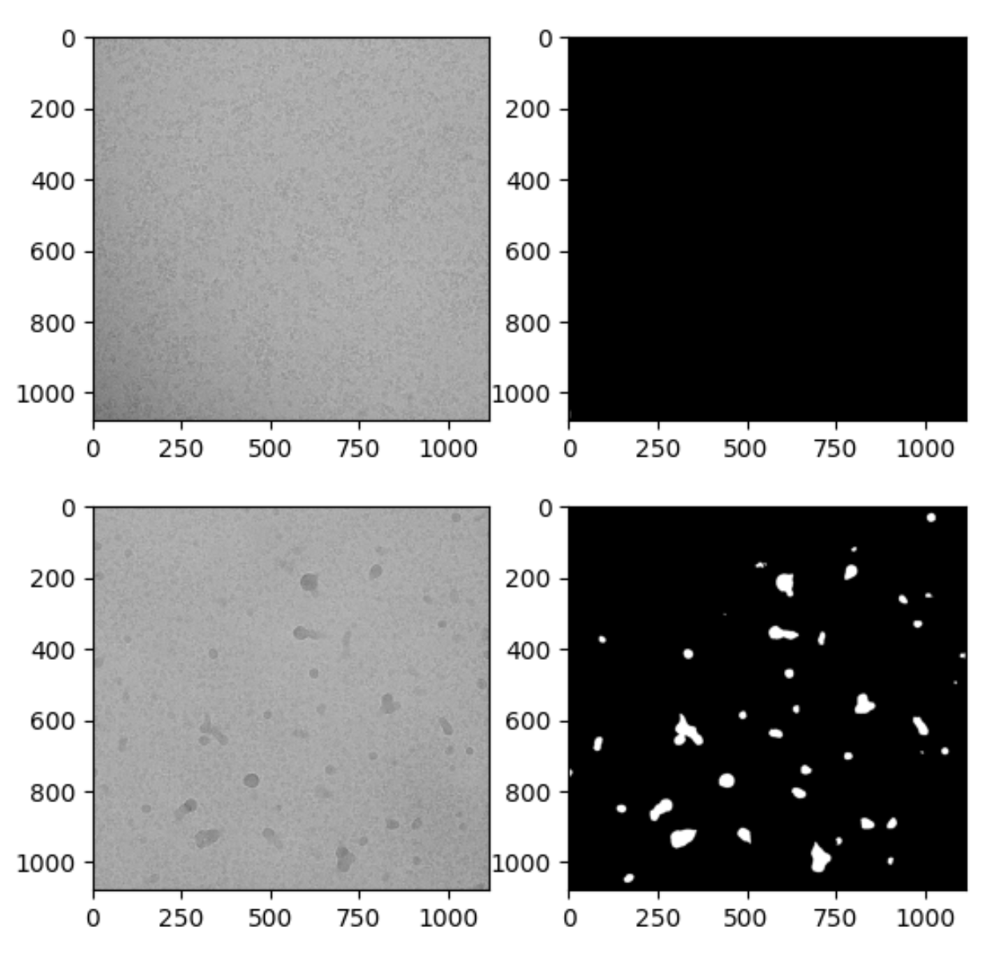

# Cryo-EM Image Segmentation Assignment

## Overview
This repository contains my submission for the **Cryo-EM Image Segmentation Kaggle competition** ([link to competition](https://www.kaggle.com/t/c29f285514e9414dbc5d77861425f9e6)).  
The task was to develop segmentation models for cryo-electron microscopy (Cryo-EM) micrographs to identify regions of contamination.  

The assignment consisted of two phases:
- **Phase 1:** Manual implementation (no pretrained models).  
- **Phase 2:** Open resources (pretrained models and external libraries allowed).  

The final model achieved:
- **Validation IoU:** ~0.78  
- **Private Score:** 0.48 (Kaggle leaderboard) 

---

## Example Data



---

## Repository Structure
```text
Computer-Vision-Micrographs/
├── kaggle_id.txt # Kaggle username
├── report.pdf # Project report (methods, experiments, results)
├── train.py # Model training script
├── infer.py # Inference script (generates predictions)
├── dataset.py # Dataset handling and preprocessing
├── model.py # Model architecture definition
├── inference_utils.py # Helper functions for inference
├── requirements.txt # Python dependencies
├── final_checkpoint.ckpt # Final trained model checkpoint (Git LFS or Release asset)
└── predictions/ # Folder created by infer.py with predicted masks
```
Data source can be found in Kaggle Competition.

---

## Methodology
The workflow and experiments are described in **report.pdf**.  
Key approaches include:

- **Phase 1:**  
  - Implemented U-Net with attention gates.  
  - Data augmentation (random crops, flips, rotations).  
  - Combined **Binary Cross-Entropy + Dice Loss**, later extended with **Focal Loss** to handle class imbalance.  
  - Built a custom **CryoLoss** function to penalize confident false predictions:contentReference[oaicite:1]{index=1}.  

- **Phase 2:**  
  - Explored pretrained architectures such as **DeepLabV3** and **Attention-Enhanced U-Net++ with EfficientNet-B5 backbone and SCSE blocks**.  
  - Fine-tuned with **CryoLoss**, achieving best performance.  

---

## Key Insights
- Aggressive augmentations (e.g., elastic, CLAHE) harmed performance on grayscale Cryo-EM data.  
- Self-attention and multi-scale attention gates in U-Net improved results significantly.  
- A custom **CryoLoss** combining BCE, Dice, and Focal loss proved critical for handling the severe class imbalance.  
- Fine-tuning pretrained models boosted validation IoU from ~0.34 to ~0.78:contentReference[oaicite:2]{index=2}.  

---

## Usage

1. **Clone the repository**
```bash
git clone https://github.com/pilarguerreromorales/Computer-Vision-Micrographs.git
cd Computer-Vision-Micrographs
```

2. **Install dependencies**
```bash
pip install -r requirements.txt
```

3. **Inference**
```bash
python infer.py
```
This will generate predicted masks in the predictions/ directory.

##  Model Checkpoint
The final trained checkpoint is stored as final_checkpoint.ckpt.
Due to file size, it isprovided in the Releases section of this repository.

## Author
Pilar Guerrero Morales
